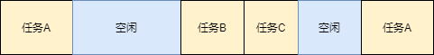

# 时间片轮询的任务调度方法（一）

## 使用场景

在MCU开发的时候肯定会碰到和时间有关的任务，例如：每10ms刷新屏幕数据，每20ms检测按键状态，每100ms读取传感器数据，电机每1分钟运行10s后关闭。

这些都是基于时间的任务，在未使用操作系统的时，有两种常见的做法：

<font color="red">**1.  使用flag记录当前任务执行状态**</font><br>（推荐指数：⭐）

> 基本思路为：在开启一个定时器中断中，作为时钟源，在中断中判断时间是否到达，时间到达后将任务标志为置位。然后在main函数的超级循环中检查标志位状态。

具体实现方式代码如下：

```c
int read_senser_flag=0, check_key_flag=0;

//1ms 定时器中断
int timer_interrupt_1ms(void)
{
    static uint32_t sys_tick=0;

    sys_tick++;

    //检测时间是否到达10ms的整数倍，到达按键检测标志位置位
    if(sys_tick%20==0)
    {
        check_key_flag=1;
    }

    //检测时间是否到达100ms的整数倍，到达按键检测标志位置位
    if(sys_tick%100==0)
    {
        read_senser_flag=1;
    }
}

int main(void)
{
    while(1)
    {
		//检查标志位状态
        if(check_key_flag==1)
        {
            check_key_flag=0;   //清除运行标志位
            check_key();		//检查按键状态
        }

        if(read_senser_flag==1)
        {
            read_senser_flag=0  //清除运行标志位
            read_senser();		//读取传感器数据
        }
    }
}
```

使用该方式编写，思路非常简单，不过使用了过多的标志位，我称之为**面象flag编程**。

对于小型简单的任务，使用该方式编写问题也不算太大。不过随着项目复杂度提高，标志位的数量急剧增长，对代码维护极不友好。

<font color="red">**2.  使用系统滴答时钟判断任务执行状态**</font><br>（推荐指数：⭐⭐）

> **实现思路**：开启一个定时器，作为系统运行时钟。在main函数的超级循环中，检查当前时钟和上次执行时间的差值是否大于执行时间间隔，大于则执行任务。

具体实现方式代码如下：

```c
#include <stdint.h>

//系统运行滴答时钟
uint32_t sys_tick=0;

//1ms 定时器中断
int timer_interrupt_1ms(void)
{
    sys_tick++;
}

//返回系统滴答时钟
uint32_t millis(void)
{
    return sys_tick;
}

int main(void)
{
    uint32_t last_read_senser_tick=0, last_check_key_tick=0;
    uint32_t last_run_motor_tick=0;

    while (1)
    {
        //检查当前时间和上一次执行时间的差值，超过20ms检查按键状态
        if(millis() - last_read_senser_tick > 20)
        {
            last_read_senser_tick=millis();
            read_senser();
        }

        //检查上一次执行时间和当前时间差值，超过100ms读取传感器数据
        if(millis() - last_check_key_tick > 100)
        {
            last_check_key_tick=millis();
            check_key();
        }

        //检查上一次电机执行时间和当前时间差值，超过60s，运行电机
        if(millis() - last_run_motor_tick > 60000)
        {
            last_check_key_tick=millis();
            run_motot();
        }

        //检查上一次电机执行时间和当前时间差值，超过10s,停止电机
        if(millis() - last_run_motor_tick > 10000)
        {
            stop_motot();
        }
    }
}
```

使用该方式对时间任务进行检查，减少flag的定义，并且可将时间判断语句定义到执行函数内部，减少全局变量的调用，优化代码结构。

该方式适用于少量定时任务的调度，当有大量的定时任务时，代码会变得重复而且臃肿。在每个定时任务的代码结构都是相同的，重复大量结构相同的代码并不是一件好的事情。

在上面的两种方法，都属于时间片轮询，不过没有形成稳定的框架，不过基本结构都是<font color="red">查询是否到达当前任务执行时间，然后依次执行任务</font>。

任务执行顺序如下图所示：



<font color="red">**3.  基于时间片轮询调度算法**</font><br>（推荐指数：⭐⭐）

在方法二的代码中，主要包含任务函数，上一次的执行时间、任务执行间隔以及执行时间查询，几部分。其中前三项为可变化的**数据**，第四项为固定的**处理逻辑**。

对上述代码进行抽象和提取后，将可变化的数据使用数据结构封装，固定的处理逻辑写成方法，这就是一个简单的时间调度算法。

具体的时间调度算法的分析和实现，见下篇文章~